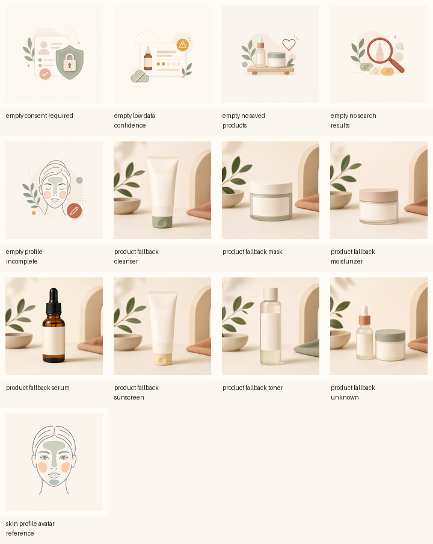

# SkinMatch Development Asset Plan

Date: 2026-06-14

This plan converts the UX concept graphics into production-safe development assets.

Core rule:

> Use generated graphics for unbranded placeholders, empty states, and visual references. Use real data, real product images, Material icons, and deterministic Compose drawing for anything that communicates product truth.

## Generated Raster Assets

Full-resolution originals live in:

`docs/ux-review-pm-handoff/generated-assets/`

Android-ready 768px copies live in:

`android-app/app/src/main/res/drawable-nodpi/`

### Product Category Fallbacks

These are used only when a real product `imageUrl` is missing or fails to load. They are intentionally unbranded and contain no readable claims.

| Asset | Android resource | Intended category mapping |
| --- | --- | --- |
| `product_fallback_serum.png` | `R.drawable.skinmatch_product_fallback_serum` | serum |
| `product_fallback_cleanser.png` | `R.drawable.skinmatch_product_fallback_cleanser` | cleanser, wash, gel |
| `product_fallback_sunscreen.png` | `R.drawable.skinmatch_product_fallback_sunscreen` | sunscreen, SPF, sun care |
| `product_fallback_moisturizer.png` | `R.drawable.skinmatch_product_fallback_moisturizer` | moisturizer, cream, lotion |
| `product_fallback_toner.png` | `R.drawable.skinmatch_product_fallback_toner` | toner |
| `product_fallback_mask.png` | `R.drawable.skinmatch_product_fallback_mask` | mask |
| `product_fallback_unknown.png` | `R.drawable.skinmatch_product_fallback_unknown` | unmapped category |

Resolver:

`productFallbackDrawableForCategory(category)` in:

`android-app/app/src/main/java/com/skinmatch/mvp/ui/assets/SkinMatchVisualAssets.kt`

### Empty-State Illustrations

These are compact UI illustrations for blocked or low-information states.

| Asset | Android resource | Intended use |
| --- | --- | --- |
| `empty_no_search_results.png` | `R.drawable.skinmatch_empty_no_search_results` | no matches for query |
| `empty_low_data_confidence.png` | `R.drawable.skinmatch_empty_low_data_confidence` | low or unknown catalog confidence |
| `empty_consent_required.png` | `R.drawable.skinmatch_empty_consent_required` | consent gate |
| `empty_profile_incomplete.png` | `R.drawable.skinmatch_empty_profile_incomplete` | profile not completed |
| `empty_no_saved_products.png` | `R.drawable.skinmatch_empty_no_saved_products` | saved/favorites empty state |

Resolver:

`emptyIllustrationDrawable(type)` in:

`android-app/app/src/main/java/com/skinmatch/mvp/ui/assets/SkinMatchVisualAssets.kt`

### Skin Profile Avatar Reference

| Asset | Android resource | Intended use |
| --- | --- | --- |
| `skin_profile_avatar_reference.png` | `R.drawable.skinmatch_skin_profile_avatar_reference` | design reference only |

The app should not rely on the reference PNG for profile state. It is a design reference for the visual language. Runtime profile visuals should use the deterministic Compose avatar.

Runtime component:

`SkinProfileAvatar(profile)` in:

`android-app/app/src/main/java/com/skinmatch/mvp/ui/components/SkinProfileAvatar.kt`

## Face Avatar Logic

The face avatar is a Compose `Canvas` component, not a generated bitmap.

Reason:
- It can reflect the user's declared skin profile.
- It avoids implying that the app scanned or diagnosed the user's face.
- It remains accessible, localizable, and adjustable without regenerating assets.

Input:

`SkinProfile`

Output:

`SkinProfileAvatarSignals`

Signal mapping:

| Profile field | Avatar behavior |
| --- | --- |
| `oilinessPattern = t_zone` | sage T-zone highlight |
| `oilinessPattern = all_over` | sage T-zone plus subtle all-over oiliness wash |
| `drynessPattern = cheeks` | soft amber cheek highlights |
| `drynessPattern = all_over` | soft all-over dryness wash plus cheek highlights |
| `sensitivityLevel = medium/high` | soft terracotta cheek sensitivity tint |
| `rednessTendency = medium/high` | soft terracotta cheek sensitivity tint |
| `poresLevel = medium/high` | small neutral pore dots around nose |
| `blackheadTendency = sometimes/often` | small neutral pore dots around nose |
| `cloggedPoreTendency = sometimes/often` | small neutral pore dots around nose |
| `acneProneBehavior = occasional/frequent` | small muted terracotta focus points |
| `dehydrationLevel = medium/high` | pale teal lower-face hydration/barrier zone |
| `barrierDamageLevel = medium/high` | pale teal lower-face hydration/barrier zone |
| `hyperpigmentationLevel = medium/high` | soft amber focus points |
| `textureConcernLevel = medium/high` | soft amber focus points |

Guardrails:
- The avatar represents self-reported profile fields only.
- It must never be described as face analysis, diagnosis, detection, or a medical assessment.
- Do not use disease imagery or before/after comparisons.
- Pair the avatar with text labels or accessible descriptions when it is used for decisions.

## What Should Not Be Generated As Raster Assets

Keep these as Compose, Material icons, or vector drawables:

- Verification icon
- Data confidence icon
- Caution/warning icon
- Search icon
- Save/favorite icon
- Navigation icons
- Fit/confidence meters
- Ingredient group chips
- Score rings or progress bars

Reason:

These communicate structured product state. They need to be deterministic, accessible, themeable, and consistent across densities.

## Development Integration Sequence

1. Add an image-loading component for product cards.
   - Use real `imageUrl` first.
   - On missing or failed image, call `productFallbackDrawableForCategory(category)`.
   - Keep stable dimensions so product cards do not jump while loading.

2. Add empty-state illustration support.
   - Extend existing `StateCard`, `EmptyState`, `LowConfidenceState`, and `ConsentBlockedState` to optionally render an illustration.
   - Use `emptyIllustrationDrawable(type)`.

3. Add `SkinProfileAvatar` to profile/home surfaces.
   - Start in profile summary or the future home dashboard.
   - Do not use the reference PNG except in design docs or preview-only surfaces.

4. Redesign search cards.
   - Replace `ProductBottle` placeholder with the product image component.
   - Use generated fallbacks only when real imagery is unavailable.

5. Redesign detail header.
   - Use real product image or fallback thumbnail.
   - Surface data confidence, verification, ingredient groups, and caution language before raw ingredient text.

## Asset Contact Sheet

For quick review:

