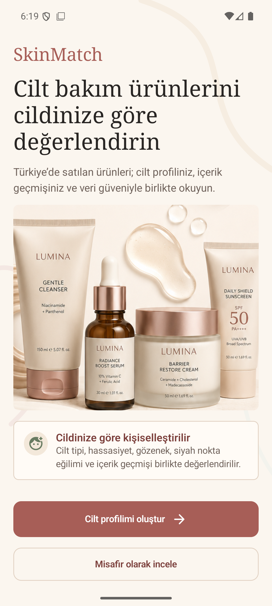
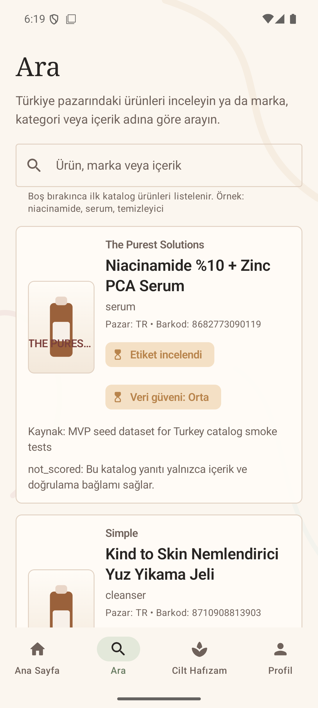
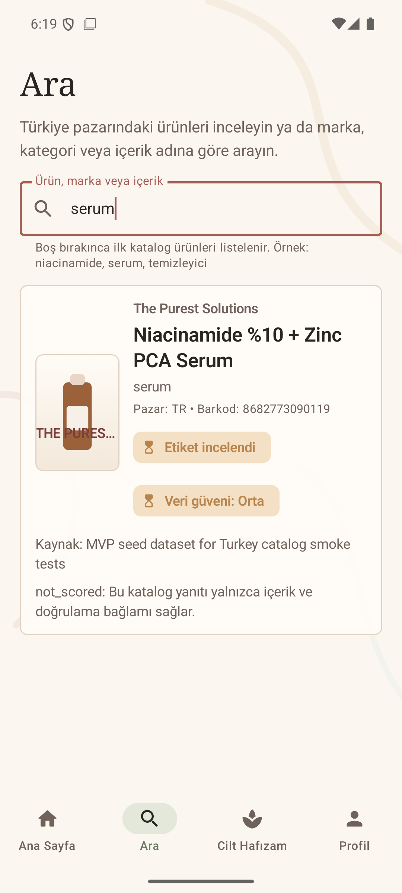
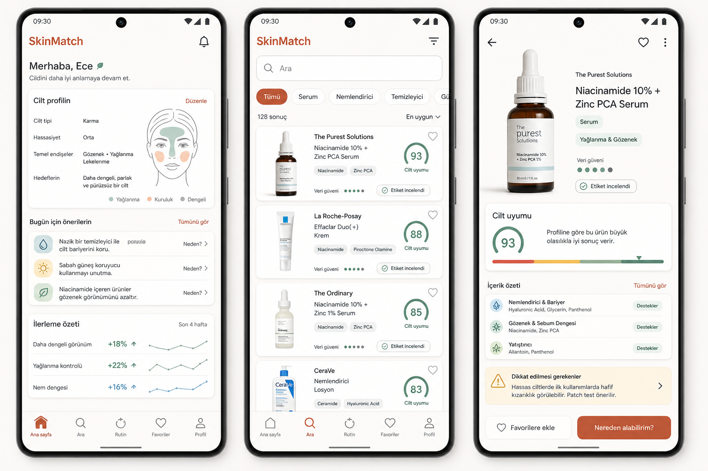

# SkinMatch Mobile UX Review - PM Handoff

Date: 2026-06-14

Scope reviewed:
- Android app shell in `android-app/`
- Rendered welcome and product search flows on `DockJam_API36`
- Compose source for onboarding, consent, profile summary, home tabs, search, and product detail
- One generated UX concept board for visual direction

## Executive Take

SkinMatch should become **more graphical, but not more decorative**.

The current app already has a calm premium skincare identity: warm surfaces, serif display type, cautious copy, and a strong welcome image. The next UX step is to make graphics do product work: product recognition, personal skin context, ingredient meaning, data confidence, and next actions.

The app should not become a beauty marketing page. It should feel like a trustworthy skincare intelligence tool for Turkey-market product discovery.

## Current Evidence

### Current Welcome



Notes:
- Strong first impression and brand mood.
- The hero image makes the app feel much more polished than the generic bottle placeholder.
- First screen is vertically heavy; users reach utility only after a large brand/hero block.

### Current Search / Default Results



Notes:
- Search is clean and understandable.
- Default catalog results are useful; empty search does not feel dead.
- Result cards are information-rich, but the visual hierarchy is not yet decision-oriented.

### Current Search Query Results



Notes:
- Verification and confidence are present, which is good.
- Generic product placeholder has low trust value and competes with real product information.
- Backend-oriented text such as `not_scored` should be translated into user-facing language.

## Generated Concept Direction



Concept intent:
- Show how SkinMatch can become more graphical while staying practical.
- Use product imagery, confidence badges, ingredient chips, compact charts, and profile visuals.
- Keep the app task-first, not campaign-first.

Important caveat:
- This is a directional concept only. It includes illustrative product/brand examples and should not be shipped as production UI or production imagery.

Generation provenance:
- Mode: built-in image generation tool.
- Prompt summary: high-fidelity mobile UX concept board with three Android screens for SkinMatch: personalized home dashboard, graphical product search results, and product detail with fit summary, ingredient groups, caution notes, verification, and data confidence. Visual style requested: modern Material 3 inspired, premium skincare, evidence-based, warm off-white / terracotta / sage / amber palette, no diagnosis claims, no before/after imagery, no marketing landing page.

## Product Direction

Recommended positioning:

> A calm, evidence-aware skincare product reader that helps users understand product fit, ingredient context, and data confidence before they buy or try something.

UX principle:

> Every visual element should answer a user question.

Use graphics for:
- Product recognition
- Skin profile summary
- Face-zone or concern maps
- Ingredient groups
- Verification and confidence
- Empty states and onboarding guidance

Avoid graphics for:
- Medical diagnosis
- Before/after promises
- Artificial certainty
- Fake product claims
- Decorative filler that pushes decisions lower

## Key UX Findings

1. Welcome is polished, but utility starts late.
   - Keep the premium product hero, but make the next step obvious and reduce repetition below the fold.

2. Search has good data structure, but weak product recognition.
   - Replace the generic drawn bottle with real product images when available.
   - When no image exists, use category-aware fallback assets: serum, cleanser, sunscreen, moisturizer.

3. Result cards should make decisions faster.
   - Put product name, product image, verification, confidence, and top ingredient tags into a scannable structure.
   - Move source/debug-style notes lower or behind an info affordance.

4. Product detail should open with a decision summary.
   - Before raw ingredient text, show: "What is this?", "How confident is the data?", "What ingredients matter?", and "What should I be careful about?"

5. Home and Memory need a stronger product story.
   - Home should become a personalized dashboard.
   - Memory should become ingredient/product history later; for now, the empty state can preview that future value visually.

6. Onboarding is functional but text-heavy.
   - Use face-zone maps, level scales, and simple concern icons to reduce cognitive load.

## Recommended Backlog

### P0 - Product Trust and Recognition

1. Product image component
   - Use `imageUrl` when available.
   - Fall back to generated or designed category placeholders.
   - Never generate fake branded packaging for production result cards.

2. Product result card redesign
   - Show product image, brand, name, category, key ingredient chips, verification, confidence, and caution state.
   - Make confidence and verification readable at a glance.

3. Product detail summary panel
   - Top of detail should include product image, verification, data confidence, key ingredient groups, and caution notes.
   - Raw ingredient text should sit lower or be collapsible.

### P1 - Personalization Surfaces

4. Home dashboard
   - Add skin profile summary, top concerns, next recommended actions, and recent product reads.

5. Skin profile visual summary
   - Add a face-zone or concern-map visualization.
   - Use it in onboarding completion and home.

6. Onboarding visual selectors
   - Replace some pill-only choices with scales, zone maps, or compact icons.

### P2 - Brand Polish

7. Empty-state illustration set
   - Consent required
   - No search results
   - Low data confidence
   - Profile incomplete

8. Copy polish
   - Translate backend statuses into product language.
   - Example: replace `not_scored` with "Uyumluluk skoru hesaplanmadi" or "Bu ekran yalnizca katalog ve icerik baglami sunar."

## Image Generation Plan

Use generated images for:
- Category fallback thumbnails
- Welcome/editorial hero images
- Empty states
- Non-medical profile visuals
- Concept exploration

Do not use generated images for:
- Real product identity when product images exist
- Medical evidence
- Product efficacy claims
- Ingredient safety claims
- User-specific skin diagnosis

Suggested asset prompts:

### Category Thumbnail Set

```text
Create a clean skincare product thumbnail for a mobile product catalog fallback.
Subject: unbranded [serum / cleanser / sunscreen / moisturizer] packaging.
Style: realistic product photography, premium but neutral.
Background: warm off-white studio surface.
Constraints: no brand names, no readable claims, no medical claims, no fake certification marks, no watermark.
Composition: centered product, generous padding, usable at small mobile-card size.
```

### Skin Profile Visual

```text
Create a minimal face-zone map for a skincare profile dashboard.
Style: clean line illustration with soft functional color zones.
Zones: T-zone, cheeks, chin, forehead.
Use colors for oiliness, dryness, redness, and balanced areas.
Constraints: no realistic disease depiction, no diagnosis, no before/after image, no person identity, no text labels inside the image unless requested.
```

### Empty State Illustration

```text
Create a compact mobile app empty-state illustration for [no search results / low data confidence / consent required / profile incomplete].
Style: calm skincare intelligence app, warm off-white, terracotta, sage, amber.
Constraints: no medical diagnosis, no alarmist imagery, no brand names, no watermark.
```

## Suggested Success Metrics

- Search result card comprehension in under 5 seconds.
- Increased product detail opens from search results.
- Reduced onboarding drop-off per step.
- Increased profile completion rate.
- Fewer support questions about confidence, verification, and scoring.

## Implementation Notes

- Android build passes when `JAVA_HOME` points to Java 17.
- Current default Java on the machine was Java 11, which fails Android Gradle Plugin startup.
- Product search is now using the live local backend at `10.0.2.2:3000`.
- The current screenshots were captured from the emulator after launching the app against the local backend.

## Asset Inventory

- `assets/current-welcome.png`
- `assets/current-search-idle.png`
- `assets/current-search-results.png`
- `assets/skinmatch-ux-concept.png`
- `generated-assets/` contains generated development assets derived from the concept direction.
- `DEVELOPMENT_ASSET_PLAN.md` explains how to use generated assets and the runtime face-avatar logic.
