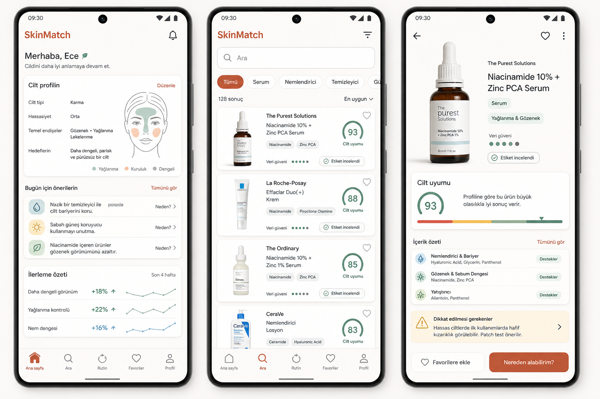

# UX Design Reference and Real Data Plan

Date: 2026-06-17

## Why This Exists

The UX designer mockups are now the reference direction for SkinMatch after the
welcome screen. The current app has pieces of the foundation: product search,
product detail, confidence, verification, safe copy, product fallback graphics,
and profile visualization. It does not yet match the intended product shape.

Reference image:

## What The Mockups Establish

### Home Dashboard

The home screen should become a personal command center, not a placeholder.

Target surfaces:
- Greeting and notification entry.
- `Cilt profilin` card with editable profile fields and face-zone visual.
- `Bugun icin onerilerin` list with simple, explainable next actions.
- `Ilerleme ozeti` trend cards for user-tracked outcomes.
- Bottom navigation: `Ana sayfa`, `Ara`, `Rutin`, `Favoriler`, `Profil`.

Implementation note: the current `Cilt Hafizam` tab can evolve into `Rutin` or
split later into routine/history depending on scope.

### Product Search

Search should feel like a high-trust product browser.

Target surfaces:
- Search bar plus filter control.
- Category chips: all, serum, moisturizer, cleanser, sunscreen.
- Result count and sort control.
- Product result cards with real product image, brand, name, ingredient chips,
  favorite affordance, verification state, data confidence, and match summary.

Implementation note: product image and fallback thumbnails now exist, but result
cards still need stronger hierarchy, favorite affordance, filter chips, sort,
and top ingredient chips.

### Product Detail

Detail should open with product recognition and decision support.

Target surfaces:
- Large product image.
- Brand, product name, category, concern tags.
- Data confidence dots and verification chip.
- `Cilt uyumu` module.
- Ingredient summary grouped by user meaning, not raw backend structure.
- Caution card for uncertainty, irritation risk, or patch-test guidance.
- Favorite and shopping/availability actions.

Implementation note: the current detail screen already shows limited-data copy,
verification, confidence, highlighted ingredients, and caution language. It
still needs the stronger visual hierarchy and real product image rights.

## Critical Safety Boundary

The mockups show numeric `Cilt uyumu` scores such as `93`. Treat that as a
future UI pattern, not as a launch-ready claim.

Do not ship numeric match scores until SkinMatch has:
- A documented scoring model.
- Data confidence thresholds.
- Regression tests for low-confidence and missing-profile cases.
- PM/legal-approved copy that avoids diagnosis, treatment, or guaranteed result
  language.

Before then, use safer states:
- `Profilinle okunuyor`
- `Veri guveni: Orta`
- `Uyumluluk skoru henuz hesaplanmadi`
- `Bu ekran katalog ve icerik baglami sunar`

## Data Needed To Support The Mockups

### Product Truth

Required fields:
- Brand name.
- Local product name.
- Canonical product name.
- Market code and locale.
- Category.
- GTIN/barcode when available.
- Raw INCI ingredient text.
- Product image URL or hosted asset reference.
- Image source and usage rights.
- Verification source, method, timestamp, and reviewer.
- Data confidence.

### Ingredient Meaning

Required fields:
- INCI name.
- Turkish display name or alias.
- Function category, for example humectant, emollient, surfactant, preservative.
- User-facing grouping, for example barrier support, sebum balance, soothing.
- Caution metadata with conservative wording.
- Source and last review date.

### Personalization

Required fields:
- Declared profile concerns.
- Declared sensitivity and triggers.
- Routine/preferences later.
- User outcome tracking later.

No camera-based inference should be implied unless a separate consented feature
is explicitly designed and legally reviewed.

## Recommended Real Data Strategy

There is no single reliable free source for Turkish skincare product names,
INCI lists, GTINs, real images, verification state, usage rights, and purchase
availability. Use a tiered catalog pipeline.

### Tier 1 - Brand Or Distributor Feeds

Best production source.

Ask brands/distributors for:
- Product master CSV/API.
- GTINs.
- INCI lists.
- Official product images with explicit usage rights.
- Product category and claims text.
- Launch/retirement updates.

Why: highest trust and cleanest image rights.

Risk: business development effort and uneven coverage.

### Tier 2 - Licensed Retailer Or Affiliate Feeds

Use only when terms allow product data and image reuse.

Good for:
- Availability.
- Seller links.
- Price range later.
- Market presence.

Do not scrape retailer pages at scale without permission. Treat retailer images
as licensed assets only if the contract/feed terms allow use in SkinMatch.

### Tier 3 - Official Verification Sources

Use these for verification, not as a complete catalog.

- ÜTS can verify registered cosmetic/medical-device product information for
  Turkey-market products and exposes citizen product query flows.
- GS1/Verified by GS1 can help validate GTIN identity and basic product-owner
  attributes.

These sources help answer "is this product identity plausible/registered?",
but they are not enough by themselves for INCI parsing, SkinMatch ingredient
meaning, product imagery rights, or product-fit UI.

### Tier 4 - Open Beauty Facts Bootstrap

Open Beauty Facts can be useful as an exploratory bootstrap or gap-filler
because it is a cosmetic product database built from label/barcode submissions.

Important caveat: Open Beauty Facts/Open Food Facts data reuse is tied to ODbL
and contribution/share-alike expectations. Keep this data isolated until legal
approves how it can coexist with proprietary brand/retailer feeds.

### Tier 5 - User And Ops Submissions

Let users or internal ops submit:
- Barcode.
- Front product photo.
- Ingredient label photo.
- Store/source URL.

Then classify as `user_submitted` until reviewed. After manual review, promote
to `label_reviewed`. Never present user-submitted data as brand-verified.

## Launch Recommendation

For initial launch readiness, build a curated verified starter catalog instead
of chasing full-market coverage.

Suggested target:
- 150-300 Turkey-market skincare products.
- Top categories: cleanser, moisturizer, sunscreen, serum, toner, mask.
- Top brands/products users actually search for.
- Every product has GTIN if available, raw ingredients, source URL, verification
  state, confidence, and either licensed real image or category fallback.

Implementation sequence:
1. Add source/license fields to product image and product source metadata.
2. Add an ops import path: CSV/JSON in, normalized product rows out.
3. Build an internal review checklist for `brand_verified`, `label_reviewed`,
   `retailer_sourced`, and `user_submitted`.
4. Import a curated 50-product pilot.
5. Expand to 150-300 after PM/legal validates the source policy.
6. Only then revisit numeric `Cilt uyumu` scoring.

## External Source Notes

- ÜTS citizen product query: https://utsuygulama.saglik.gov.tr/UTS/vatandas
- ÜTS official product tracking system: https://utsuygulama.saglik.gov.tr/UTS/
- GS1 Türkiye Verified by GS1: https://www.gs1tr.org/view/icerik/verified-by-gs1.php
- Open Beauty Facts project: https://github.com/openfoodfacts/openbeautyfacts
- Open Beauty Facts app listing: https://play.google.com/store/apps/details?id=org.openbeautyfacts.scanner
- Google Manufacturer Center API: https://developers.google.com/manufacturers/reference/rest
- Google Merchant product API overview: https://developers.google.com/shopping-content/guides/products/overview
